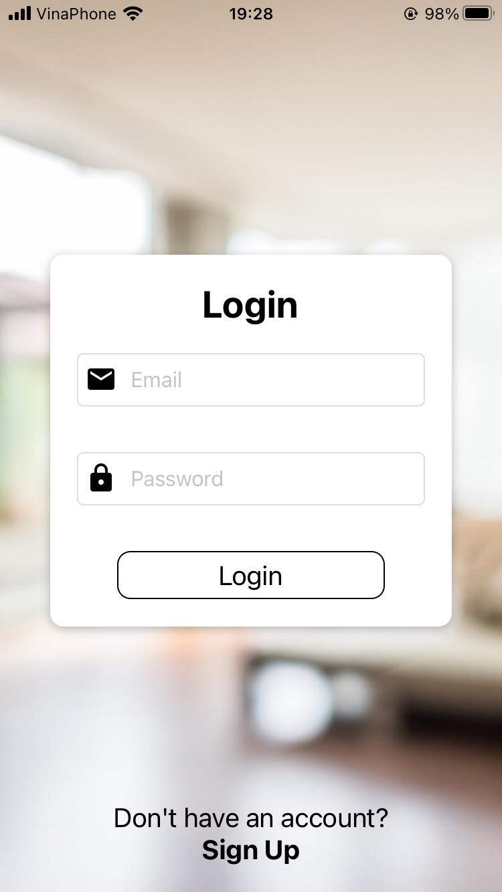

# 🔥 Home sensors monitor and fire alarm system 🚨
## 🛈 About
Q2D Home sensor system is a project that allows users to monitor temperature, humidity and carbon monoxide level in their home, along with fire alarm mechanism.

### Functionalities:
+ Provides cross-platform monitoring app using React Native ⚛️ and Firebase 🔥.
+ Send warning emails to users upon detecting unsual values from sensors.
+ Features LED and speaker to alert when there's a fire.

## 🔌 Sensor device
 
### Device components:
+ ESP8266
+ DHT11
+ MQ-7
+ LED & Small speaker (for fire alarm)

## 📸 Images
### Fire sensor box
 

### Monitoring app
 
 
 

  
  
  

