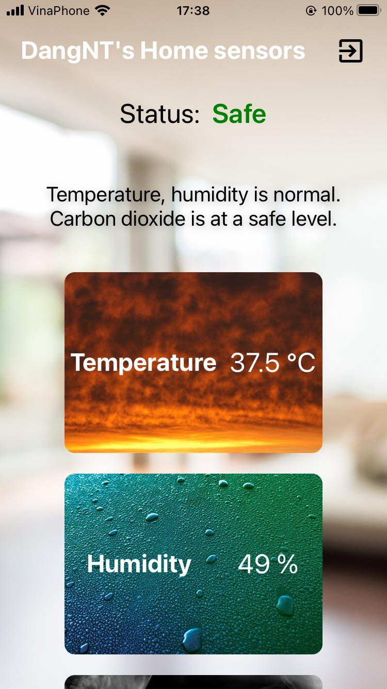

# 🔥 Home sensors monitor and fire alarm system 🚨
## 🛈 About
Q2D Home sensor system is a project that allows users to monitor temperature, humidity and carbon monoxide level in their home, along with fire alarm mechanism.

### Functionalities:
+ Provides cross-platform monitoring app using React Native ⚛️ and Firebase 🔥.
+ Send warning emails to users upon detecting unsual values from sensors.
+ Features LED and speaker to alert when there's a fire.

## 🔌 Sensor device
 
### Device components:
+ ESP8266
+ DHT11
+ MQ-7
+ LED & Small speaker (for fire alarm)

## 📸 Images
### Fire sensor box
 


### Monitoring app
 
 
 

<div align="center">
  
  
  
</div>

## 🛠️ Installation
### Clone project repository
```
git clone https://github.com/TonyQ2k3/home-sensor-system.git
npm install
npx expo start
```

### Sensor device
1. Download and install [Arduino IDE](https://www.arduino.cc/en/software).
2. Navigate to the [ESP9266 folder](./ESP8266/) inside the project folder.
3. Copy /libraries and /HomeSensorSystem  into your local Arduino directory, the default folder is `C:\Users\Documents`.
4. Edit HomeSensorSystem.ino according to your Firebase project and Wi-fi:
```
#define FIREBASE_HOST "Firebase Realtime Database URL"
#define FIREBASE_AUTH "Firebase App Auth Token"
#define WIFI_SSID "Your Wifi SSID"
#define WIFI_PASSWORD "Your Wifi Password"
```
5. In order for the device to be able to send sensor data of an user to the database, you will need to have an user created with Firebase Authentication (you can register using the app or do so directly in the console). After that you can copy the user ID then assign to the ID string.
```
String ID = "Firebase auth user id";
```

